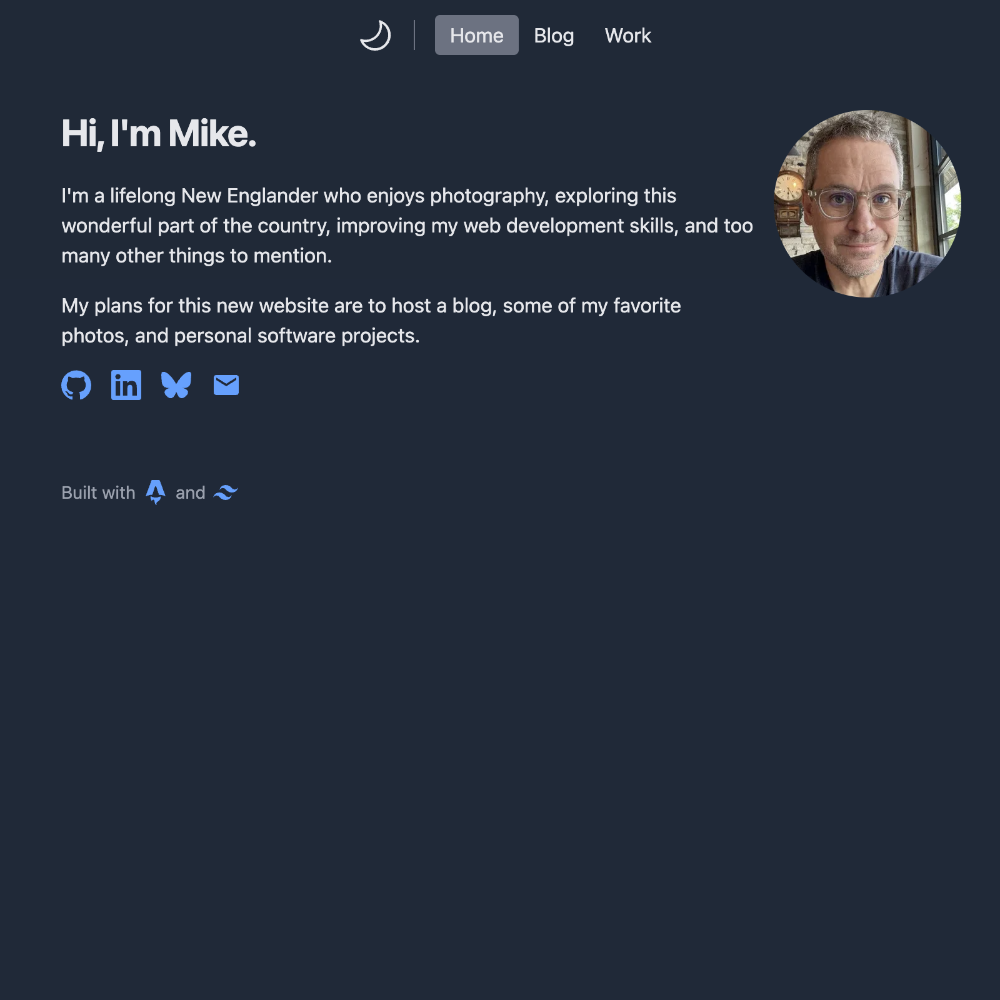

# README

A project to build a personal website using Astro. This will eventually include a blog, a photo gallery, and some web development projects. I used Astro's excellent [build a blog](https://docs.astro.build/en/tutorial/0-introduction/) tutorial as a starting point.

Live URL: [mleroux.me](https://mleroux.me)

## Features

- Responsive design with mobile dropdown menu
- Tailwind CSS utility classes handle almost all styling
- Light/dark mode switcher
- SVG icons for social and contact links
- Simple weblog:
    - Pagination
    - Tags
    - Code snippet styling
    - An RSS feed
    - An "archive" list of all posts
- Projects page featuring GitHub repos and live deployed versions
- Work page with resumé

## Tech Stack

| Service | Description |
| -------- | ----------- |
| [Astro](https://astro.build/) | Lightweight web framework |
| [Tailwind CSS](https://tailwindcss.com/) | Styling |
| [Netlify](https://www.netlify.com/) | Hosts the application |

## Improvements

- [ ] Custom photo gallery

## Run locally

Clone the repo, run two `npm` commands in the project directory, and visit [localhost:4321](http://localhost:4321).

```sh
npm install
npm run dev
```

## Screenshot


